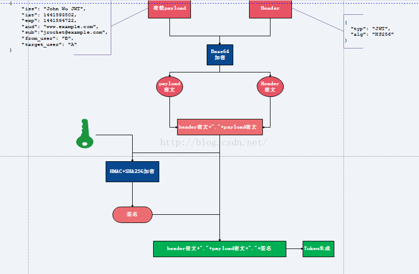
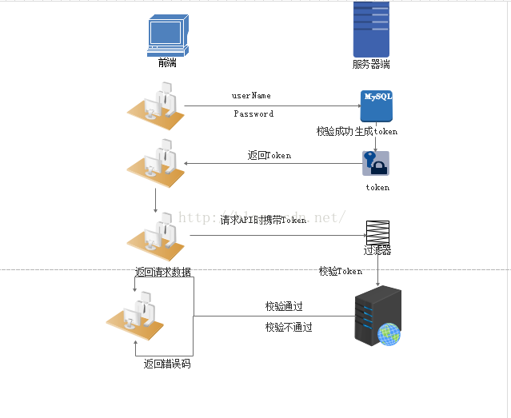

# Token验证机制

## Token原理

1. 将荷载payload，以及Header信息进行Base64加密，形成密文payload密文，header密文。
2. 将形成的密文用句号链接起来，用服务端密钥进行HS256加密，生成签名。
3. 将前面的两个密文和签名用句号链接形成最终的token返回给服务端。

注：

1. 用户请求时携带此token\(分为三部分，header密文，payload密文，签名\)到服务端，服务端解析第一部分\(header密文\)，用Base64解密，可以知道用了什么算法进行签名，此处解析发现是HS256。
2. 服务端使用原来的密钥与密文\(header密文+"."+payload密文\)同样进行HS256运算，然后用生成的签名与token携带的签名进行对比，若一致说明token合法，不一致说明原文被修改。
3. 判断是否过期，客户端通过用Base64解密第二部分\(payload密文\)，可以知道荷载中授权时间，以及有效期。通过这个与当前时间对比发现token是否过期。

## 实现思路

1. 用户登陆校验，校验成功后就返回Token给客户端。
2. 客户端收到数据后保存在客户端
3. 客户端每次访问API是携带token到服务端
4. 服务端采用filter过滤器校验，校验成功则返回请求数据，校验失败则返回错误码

