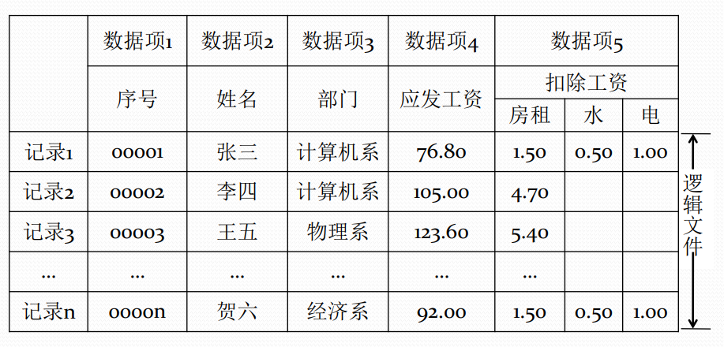

# 文件的逻辑结构

#### 逻辑文件

逻辑文件，又称为文件的逻辑结构。独立于物理环境的，用户概念中的抽象信息组织方式。用户能观察到的，并加以处理的数据集合。

文件的逻辑结构分为两种形式

* 流式文件
* 记录式文件

#### 流式文件

流式文件指文件内的数据不再组成记录，只是由一串依次的字节组成的信息流序列。

这种文件常常按长度来读取所需信息，也可以用插入的特殊字符作为分界。

#### 记录式文件

记录式文件是一种有结构的文件，它是若干逻辑记录信息所组成的记录流文件。

逻辑记录是文件中按信息在逻辑上的独立含义所划分的信息单位。

#### 记录式文件与数据库

数据库管理系统也支持逻辑记录。但数据库有别于记录式文件，数据库中的记录之间可以通过数据冗余构成某种联系。

数据库管理系统支持基于联系的数据查询，文件系统则不行。

