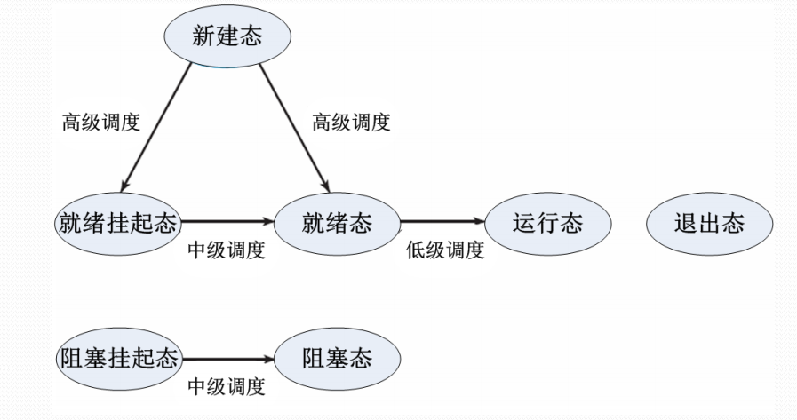

# 处理器调度

#### 处理器的调度层次

* 高级调度
  * 又称长程调度，作业调度，决定能否加入到执行的进程池中中
* 中级调度
  * 又称平衡负载调度，决定主存中的可用进程集合
* 低级调度

  * 又称断程调度，进程调度，决定哪个可用进程占用处理器执行

**高级调度**

分时OS中，高级调度决定：

* 是否接受一个终端用户的连接
* 命令能否被系统接纳并构成进程
* 新建态进程是否加入就绪进程队列

批处理OS中，高级调度又称为作业调度，功能是按照某种原则从后备作业队列中选取作业进入主存，并为作业做好运行前的准备工作和完成后的善后工作。

**中级调度**

* 引进中级调度是为了提高内存利用率和作业吞吐量
* 中级调度决定那些进程被允许驻留在主存中参与竞争处理器及其他资源，起到短期调整系统负荷的作用
* 中级调度把一些进程换出主存，从而使之进入“挂起”状态，不参与进程调度，以平顺系统的负载

**低级调度**

* 低级调度：又称处理器调度、进程调度、短程调度，按照某种原则把处理器分配给就绪态进程或内核级线程
* 进程调度程序：又称分派程序，操作系统中实现处理器调度的程序，是操作系统的最核心部分
* 处理器调度策略的优劣直接影响到整个系统的性能

**低级调度的主要功能**

* 记住进程或内核级线程的状态
* 决定某个进程或内核级线程什么时候获得处理器，以及占用多长时间
* 把处理器分配给进程或内核级线程
* 收回处理器

#### 处理器调度算法

**选择处理器调度算法的原则**

* 资源利用率
  * 使得CPU或其他资源的使用率尽可能高且能够并行工作
* 响应时间
  * 使交互式用户的响应时间尽可能小，或尽快处理实时任务
* 周转时间
  * 提交给系统开始到执行完成获得结果为止的这段时间间隔称周转时间，应该使周转时间或平均周转时间尽可能短
* 吞吐量
  * 单位时间处理的进程数尽可能多
* 公平性
  * 确保每个用户每个进程获得合理的CPU份额或其他资源份额

**处理器调度算法种类**

* 优先数调度算法
* 时间片轮转调度算法
* 分级调度算法
* 彩票调度算法

