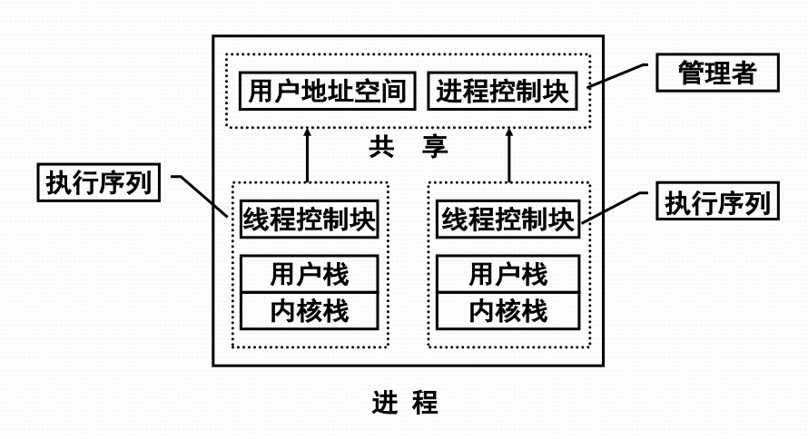

# 多线程结构进程

#### 多线程结构进程

#### 多线程环境下进程的概念

在多线程环境中，进程是操作系统中进行保护和资源分配的独立单位，具有用来容纳进程映像的虚拟地址空间和对进程、文件、设备的存取保护机制。

#### 多线程环境下线程的概念

线程是进程的一条执行路径，是调度的基本单位，同一个进程中的所有线程共享进程获得的主存空间和资源。它具有：

* 线程执行状态
* 受保护的线程上下文，当线程不运行时，用于存储现场信息
* 独立的程序指令计数器
* 执行堆栈
* 容纳局部变量的静态存储器

#### 多线程环境下线程的状态与调度

* 线程状态有运行、就绪和睡眠，无挂起
* 与线程状态有关的线程操作有
  * 孵化
  * 封锁
  * 活化
  * 剥夺
  * 指派
  * 结束
* OS感知线程环境下
  * 处理器调度对象是线程
  * 进程没有三状态（或者说只有挂起状态）
* OS不感知线程环境下
  * 处理器调度对象仍是进程
  * 用户空间中的用户调度程序调度线程

#### 并发多线程程序设计的有点

* 快速线程切换
* 减少\(系统\)管理开销
* \(线程\)通信易于实现
* 并行程度提高
* 节省内存空间

