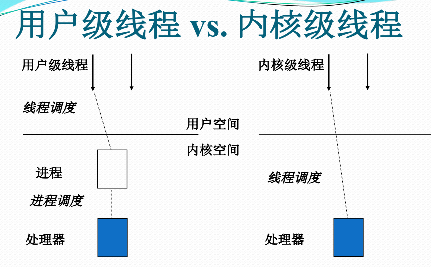
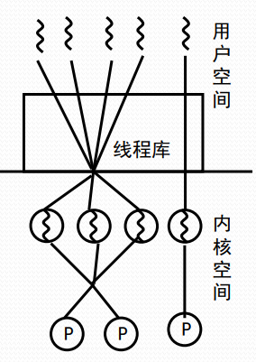
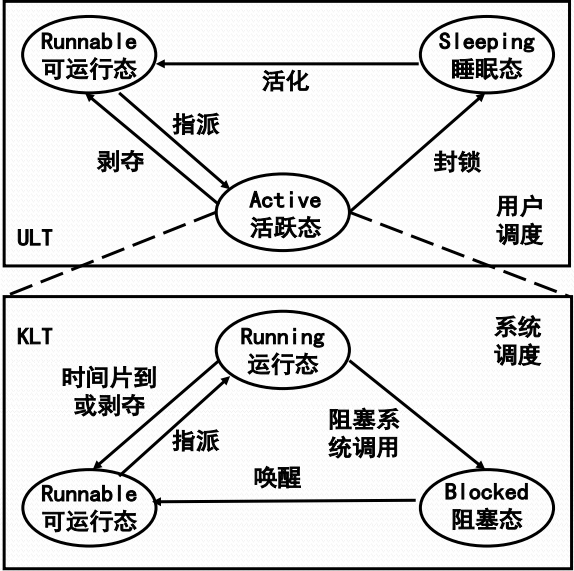
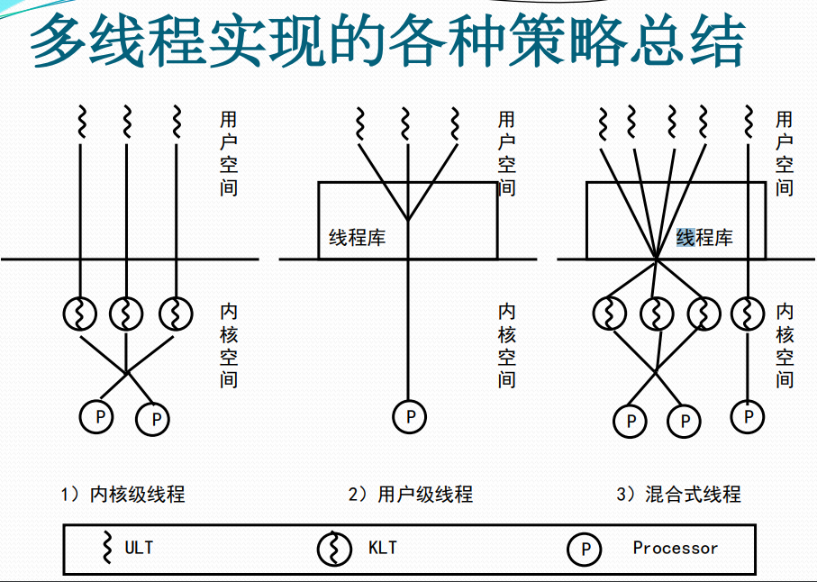

# KLT与ULK

#### 内核级线程KLT

Kernel-Level Threads

* 线程管理的所有工作由OS内核来做
* OS提供了一个应用程序设计接口API，供开发者使用KLT
* OS直接调度KLT

**内核级线程的特点**

* 进程中的一个线程被阻塞了，内核能调度同一进程的其他线程占有处理器运行
* 多处理器环境中，内核能同时调度同一进程中多个线程并行执行
* 内核自身也可用多线程技术实现，能提高操作系统的执行速度和效率
* 应用程序线程在用户态运行，线程调度和管理在内核实现，在同一进程中，控制权从一个线程传送到另一个线程时需要模式切换\(用户模式切换到内核模式\)，系统开销比较大

#### 用户级线程ULT

User-Level- Threads

* 用户空间运行的线程库，提供多线程应用程序的开发和运行支撑环境
* 任何应用程序均需通过线程库进行程序设计，再与线程库连接后运行
* 线程管理的所有工作都由应用程序完成，内核没有意识到线程的存在

**用户级线程的特点**

* 所有线程管理数据结构均在进程的用户空间中，线程切换不需要内核模式，能节省模式切换开销和内核的宝贵资源
* 允许进程按应用特定需要选择调度算法，甚至根据应用需求裁剪调度算法
* 能运行在任何OS上，内核在支持ULT方面不需要做任何工作
* 不能利用多处理器的优点，OS调度进程，仅有一个ULT能执行
* 一个ULT的阻塞，将引起整个进程的阻塞\(可通过Jacketing技术解决\)

Java多线程是用户级多线程，无法利用多处理器的优点\(后半句存疑\)。

**Jacketing技术**

* 把阻塞式系统调用改造成非阻塞式的
* 当线程陷入系统调用时，执行jacketing程序
* 由jacketing程序来检查资源使用情况，以决定是否执行进程切换或传递控制权给另一个线程

#### 对比

* ULT适用于解决逻辑并行性问题
* KLT适用于解决物理并行性问题

#### 多线程实现的混合式策略

* 线程创建是完全在用户空间做的
* 单应用的多个ULT可以映射成一些KLT，通过调整KLT数目，可以达到较好的并行效果

#### 多线程实现混合式策略的特点

* 组合用户级线程/内核级线程设施
* 线程创建完全在用户空间中完成，线程的调度和同步也在应用程序中进行
* 一个应用中的多个用户级线程被映射到一些\(小于等于用户线程数目\)内核级线程上
* 程序员可以针对特定应用和机器调节内核级线程的数目，以达到整体最佳结果
* 该方法将会结合存粹用户级线程方法和内核级线程方法的优点，同时减少它们的缺点

#### 线程混合式策略下的线程状态

* KLT三态，系统调度负责
* ULT三态，用户调度负责
* 活跃态ULT代表绑定KLT的三态
* 活跃态ULT运行时可激活用户调度
* 非阻塞系统调用可使用Jacketing启动用户调度，调整活跃态ULT

#### 多线程实现的各种策略

