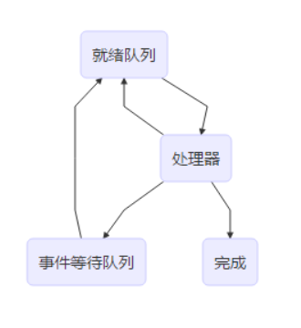

# 进程管理

#### 关键的进程管理软件

* 关键的进程管理软件包括
  * 系统调用/中断/异常处理程序
  * 队列管理模块
  * 进程控制程序
  * 进程调度程序（独立进程居多）
  * 进程通信程序（多个程序包）
  * 终端登陆与作业控制程序、性能监控程序、审计程序等外围程序

#### 进程实现的队列模型

进程提交到就绪队列后指派到处理器。

如果出现等待事件，则进入各种等待事件对应的事件等待队列。当事件出现时，对应的事件等待队列中的进程将被提交到就绪队列。

如果就绪队列中的进程比处理中运行的进程优先级高，则发生抢占，处理器中的进程进入就绪队列。

如果处理器中的进程超时，则进入就绪队列。

#### 队列管理模块

队列管理模块是操作系统实现进程管理的核心模块。

操作系统建立多个进程队列，包括就绪队列和等待队列。

按需组织为先进先出队列与优先队列

队列中的进程可以通过进程控制块\(PCB\)中的队列指引元采用单/双指引元或索引连接

出队和入队操作

进程与资源调度围绕进程队列展开

#### 进程的控制与管理

**进程创建**

进程表加一项，申请进程控制块\(PCB\)并初始化，生成标识，建立内存映像，分配资源，移入就绪队列。

**进程撤销**

从队列中移除，归还资源，撤销标识，回收PCB，移除进程表项。

**进程阻塞**

保存现场信息，修改PCB，移入等待队列，调度其他进程执行。

**进程唤醒**

等待队列中移出，修改PCB，移入就绪队列\(该线程优先级高于运行进程触发抢占\)。

**进程挂起**

修改状态并出入相关队列，收回内存等资源送至对换区。

**进程激活**

分配内存，修改状态并出入相关队列

#### 原语与进程控制原语

进程控制过程中涉及对OS核心数据结构\(进程表/PCB池/队列/资源表\)的修改。为防止与时间有关的错误，应使用原语。

**原语**

原语是由若干条指令构成的完成某种特定功能的程序，执行上具有不可分割性。

原语的执行可以通过关中断实现。

**进程控制原语**

进程控制使用的原语称为进程控制原语。另一类常用原语是进程通信原语。

