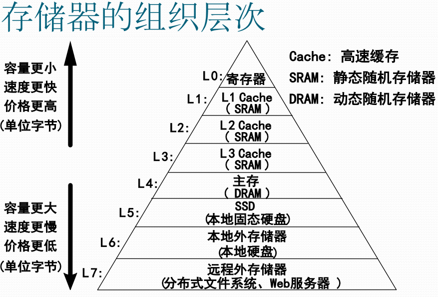
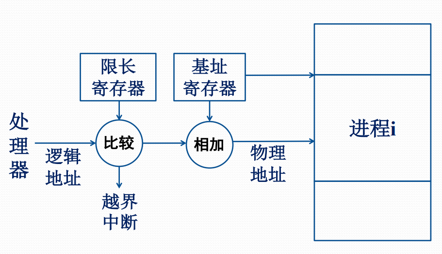

# 存储器的硬件支撑

#### 存储器的组织层次

#### 存储管理涉及的存储对象

存储管理是OS管理主存储器的软件部分。

为获得更好的处理器性能，部分主存程序与数据\(特别是关键性能数据\)被调入Cache，存储管理需要对其进行管理，甚至包括对联想存储器的管理。

为获得更大的虚拟地址空间，存储管理需要对存放在硬盘、固态硬盘、甚至网络硬盘上的虚拟存储器文件进行管理。

#### 高速缓存存储器\(Cache\)

Cache是介于CPU和主存储器间的高速小容量存储器，由静态存储芯片SRAM组成，容量较小但比主存DRAM技术更加昂贵而快速，接近于CPU的速度。

CPU往往需要重复读取同样的数据块，Cache的引入与缓存容量的增大，可以大幅提升CPU内部读取数据的命中率，从而提高系统性能

#### 高速缓存存储器的构成

高速缓冲存储器通常由高速存储器、联想存储器、地址转换部件、替换逻辑等组成

**联想存储器**

根据内容进行寻址的存储器。

**地址转换部件**

通过联想存储器建立目录表以实现快速地址转换。命中时直接访问Cache;未命中时从内存读取放入Cache。

**替换部件**

在缓存已满时按一定策略进行数据替换，并修改地址转换部件

#### 高速缓存存储器的分级

**L1 Cache**

分为数据缓存和指令缓存。在CPU中内置，成本最高，对CPU性能影响最大。通常在32KB-256KB之间。

**L2 Cache**

分内置和外置两种，后者性能低一些，通常在512KB-8MB之间。

**L3 Cache**

多为外置，在游戏和服务器领域有效。但对很多应用来说，总线改善比设置L3更加有利于提升系统性能。

#### 地址转换/存储保护的硬件支撑

#### 存储管理与硬件支持

鉴于程序执行与数据访问的局部性原理，存储管理软件使用Cache可以大幅度提升程序执行效率。

动态重定位、存储保护等，若无硬件支撑在效率上是无意义的，即无实现价值。

无虚拟地址中断，虚拟存储器无法实现。

无页面替换等硬件支撑机制，虚拟存储器在效率上是无意义的。

