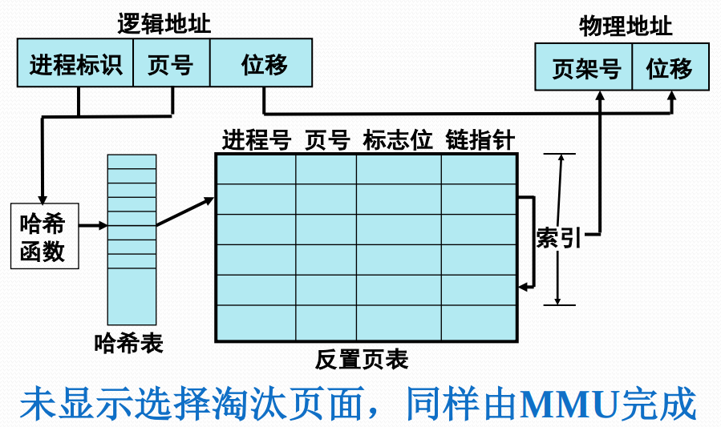

# 反置页表

#### 反置页表的提出

页表及相关硬件机制在地址转换、存储保护、虚拟地址访问中发挥了关键作用。

内存管理单元MMU是为页式存储管理设置的专门硬件机构。MMU是CPU管理虚拟/物理存储器的控制线路，把虚拟地址映射为物理地址，并提供存储保护，必要时确定淘汰页面。

反置页表是MMU用的数据结构，用来完成内存页架到访问进程页号的对应，即物理地址到逻辑地址的转换。

#### 反置页表的基本设计思想

针对内存中的每个页架建立一个页表，按照块号排序。

**反置页表的页表项**

* 页号
  * 虚拟地址页号
* 进程标志符
  * 使用该页的进程号 
* 标志位
  * 有效、引用、修改、保护和锁定等标志信息。
* 链指针
  * 哈希链 

#### 基于反置页表的地址转换过程

MMU通过哈希表把进程标识和虚页号转换成一个哈希值，指向反置页表的一个标目。

MMU遍历哈希链找到所需进程的虚页号，该项的索引就是页架号，通过拼接位移便可生成物理地址。

若遍历整个反置页表中未能找到匹配页表项，说明该页不在内存，产生缺页中断，请求操作系统调入。

