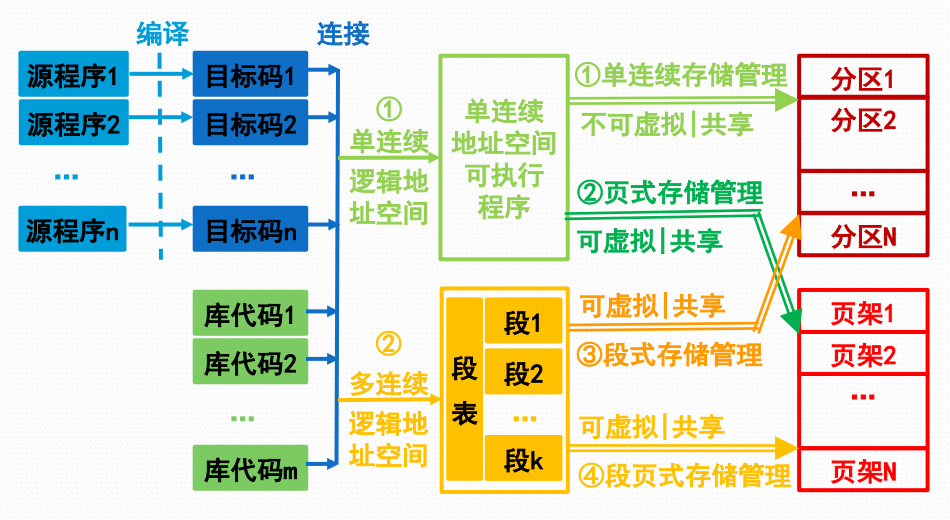

# 存储管理的主要模式

#### 逻辑地址

又称相对地址，即用户编程所使用的地址空间。

逻辑地址从0开始编号，有两种形式：

* 一维逻辑地址\(地址\)
* 二维逻辑地址\(段号:段内地址\)

#### 物理地址

又称绝对地址，即程序执行所使用的地址空间。

处理器执行指令时按照物理地址进行

#### 段式程序设计

把一个程序设计成多段，代码段、数据段、堆栈段等等。

用户可以自己应用段覆盖技术\(这一技术是程序设计技术，不是OS存储管理的功能\)扩充内存空间使用量。

#### 主存储器的复用

多道程序设计需要复用主存

按照分区复用

* 主存划分为多个固定/可变尺寸的分区
* 一个程序/程序段占用一个分区

按照页架复用

* 主存划分成多个固定大小的页架
* 一个程序/程序段占用多个页架

#### 存储管理的基本模式

* 单连续存储管理
  * 一维逻辑地址空间的程序占用一个主存固定分区或可变分区
* 段式存储管理
  * 段式二维逻辑地址空间的程序占用多个主存可变分区
* 页式存储管理
  * 一维逻辑地址空间的程序占用多个主存页架区
* 段页式存储管理
  * 段式二维逻辑地址空间的程序占用多个主存页架区

#### 存储管理模式示意图

