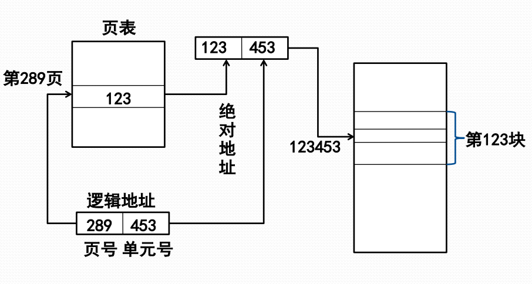
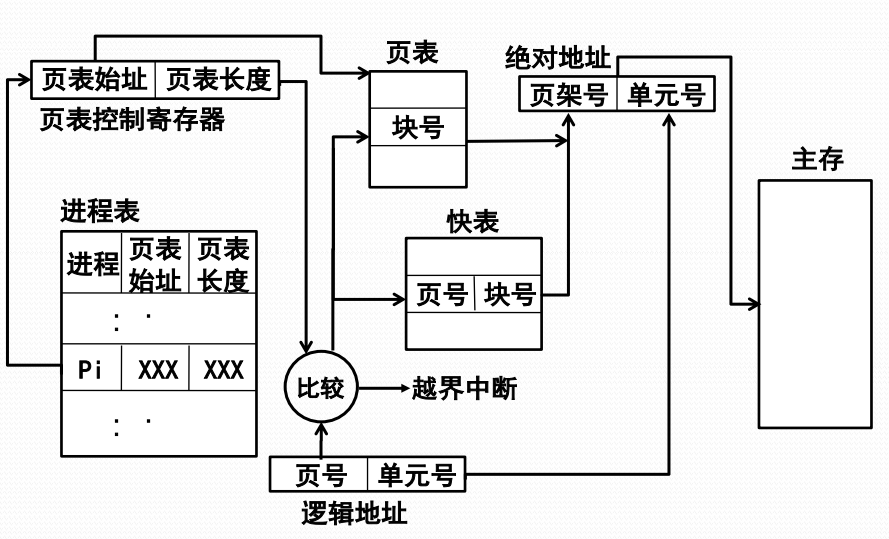

# 页式存储管理的基本原理

#### 基本原理

**分页存储器**将主存划分成多个大小相等的页架。受页架尺寸限制，程序的逻辑地址也分成**页**。不同的**页**可以放在不同的**页架**中，不需要连续。**页表**用于维系进程的主存完整性。

#### 页式存储管理中的地址

**逻辑地址**

页式存储管理的逻辑地址由两部分组成，**页号和单元号**，逻辑地址形式：

| 页号 | 单元号 |
| :--- | :--- |

**物理地址**

页式存储管理的物理地址也有两部分组成，**页架号和单元号**，物理地址形式：

| 页架号 | 单元号 |
| :--- | :--- |

#### 地址转换

逻辑地址与物理地址的地址转换可以通过查页表完成。

**转换代价**

页表放在主存，每次地址转换必须访问两次主存。

1. 按页号读出页表中的相应页架号
2. 按计算出来的绝对地址进行读写

因此，可以利用Cache存放部分页表，这一部分被称为快表。快表包含**页号和页架号**。

**基于快表的地址转换流程**

1. 按逻辑地址中的页号查快表 
2. 若该页已在快表中，则由页架号和单元号形成绝对地址
3. 若该页不在快表中，则再查主存页表形成绝对地址，同时将该页登记到快表中。
4. 当快表填满后，又要登记新页时，则需在快表中按一定策略淘汰一个旧登记项

#### 页式存储管理的内存分配/去配

可用一张位式图来记录主存分配情况。

