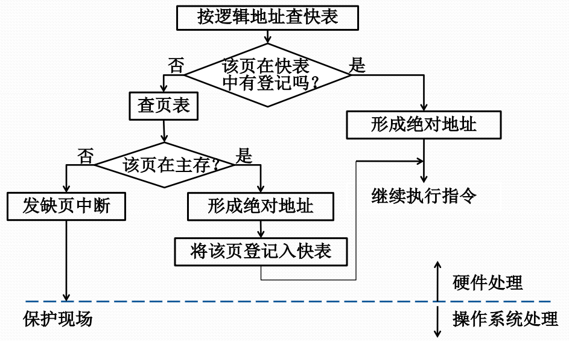
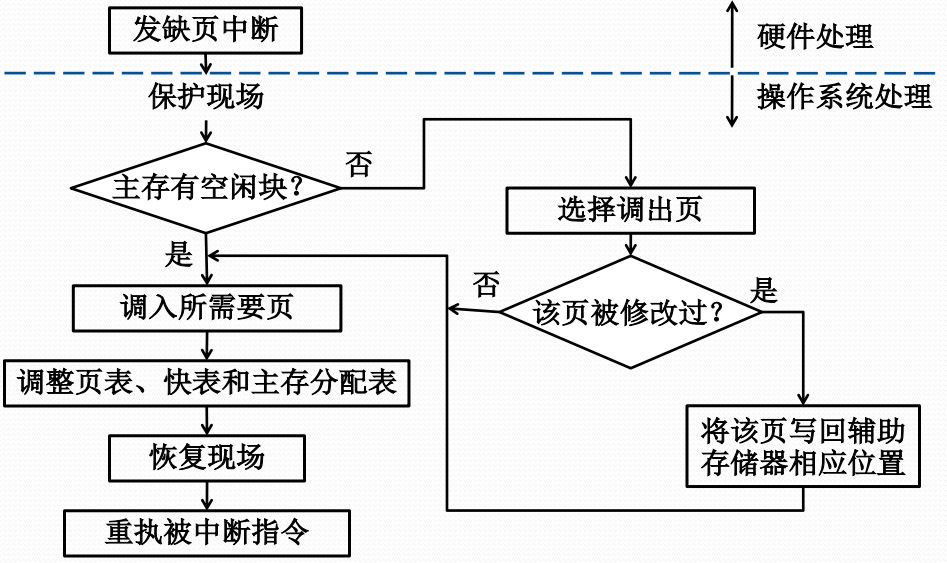

# 页式虚拟存储管理

#### 基本思想

把进程全部页面装入虚拟存储器，执行时先把部分页面装入实际内存，然后，根据执行行为，动态调入不在主存的页，同时进行必要的页面调出。

页式虚拟存储管理是现在OS的主流管理技术。

首次只把进程第一页信息装入主存，称为请求页式存储管理。

#### 页式虚拟存储管理的页表

除了页架号与页号的对应关系外，还需要扩充其他页表项。

包括每页的虚拟地址、实际地址、主存驻留标志、写回标志、保护标志、引用标志、可移动标志。

#### 页式虚拟存储管理的实现

* CPU处理地址
  * 若页驻留，则获得块号形成绝对地址
  * 若页不在内存，则CPU发出缺页中断
* OS处理缺页中断
  * 若有空闲页架，则根据辅存地址调入页，更新表与快表等
  * 若无空闲页架，则决定淘汰页，调出已修改页，调入页，更新页表与快表。

#### 页式虚拟存储管理的地址转换

#### 缺页中断的处理流程

