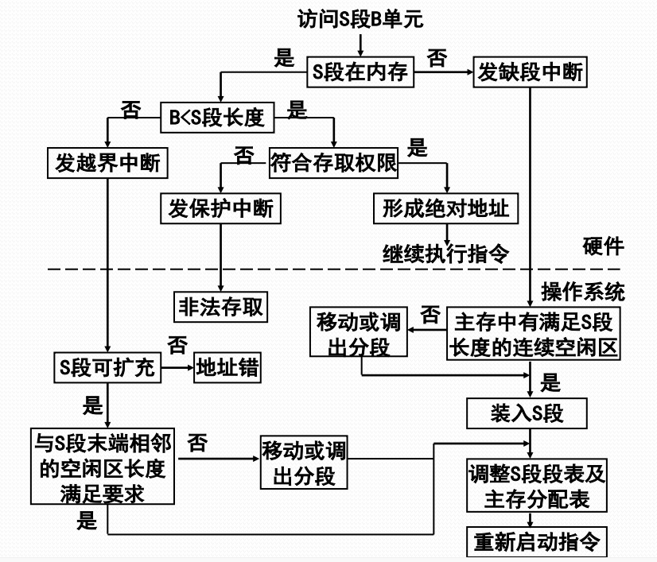

# 段式虚拟存储

#### 段式虚拟存储管理的基本思想

把进程的所有分段都存放在辅存中，进程运行时先把当前需要的一段或几段装入主存，在执行过程中访问到不再主存的段时再把它们动态装入。

段式虚拟存储管理中段的调进调出是由OS自动实现的，对用户透明。

#### 段式虚拟存储管理的段表扩充

| 段号 | 特征 | 存储权限 | 扩充位 | 标志 | 主存始址 | 限长 | 辅存始址 |
| :--- | :--- | :--- | :--- | :--- | :--- | :--- | :--- |

* 特征位
  * 00：不在内存
  * 01：在内存
  * 11：共享段
* 存取权限
  * 00：可执行
  * 01：可读
  * 11：可写
* 扩充位
  * 0：固定长
  * 1：可扩充
* 标志位
  * 00：未修改
  * 01：已修改
  * 11：不可移动

#### 段式虚拟存储管理的地址转换

