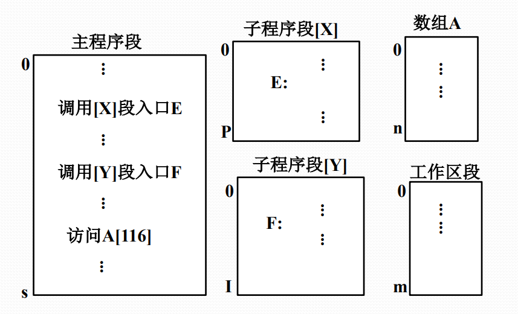
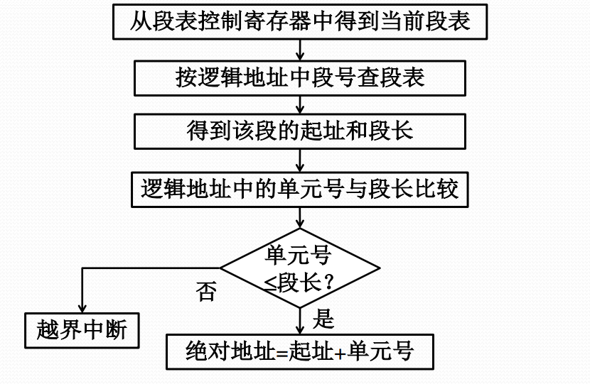

# 段式存储管理

#### 段式程序设计

每个程序可由若干个段组成，每一段都可以从“0”开始编址，段内的地址是连续的。

分段存储器的逻辑地址由两部分组成，段号+单元号。

#### 段式存储管理的基本思想

段式存储管理基于可变分区存储管理实现，一个进程要占用多个分区。

硬件需要增加一组用户可见的段地址寄存器（代码段、数据段、堆栈段，附加段），供地址转换使用。

存储管理需要增加设置一个段表，包括**段始址、段限长，以及存储保护、可移动、可扩充等标志位**。

#### 段的共享

通过不同进程段表中的项指向同一个段基址来实现。

对共享段的信息必须进行保护，如规定只能读出不能写入，不满足保护条件则产生保护中断。

