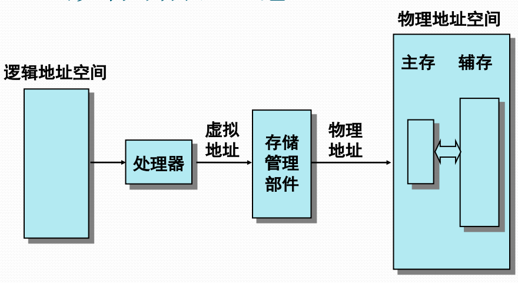

# 虚拟存储器的概念

#### 虚拟存储器思想的提出

* 主存容量限制带来诸多不便
  * 用户编写程序必须考虑主存容量限制
  * 多道程序设计的道数受到限制
* 用户编程行为分析
  * 全面考虑各种情况，执行时有互斥性
  * 顺序性和循环性等空间局部性行为
  * 某一阶段执行的时间局部性行为

因此可以考虑部分调入进程内容

#### 虚拟存储器的基本思想

存储管理把进程全部信息放在辅存中，执行时先将其中一部分装入主存，以后根据执行行为随用随调入

如主存中没有足够的空闲空间，存储管理需要根据执行行为把主存中暂时不用的信息调出到辅存上去。

#### 虚拟存储器的实现思路

* 需要建立与自动管理两个地址空间
  * \(辅存\)虚拟地址空间
    * 容纳进程装入
  * \(主存\)实际地址空间
    * 承载进程执行

对于用户，计算机系统具有一个容量大得多的主存空间，即虚拟存储器。

虚拟存储器是一种地址空间扩展技术，通常意义上对用户编程是透明的，除非用户需要进行高性能的程序设计。

#### 虚拟存储器示意

